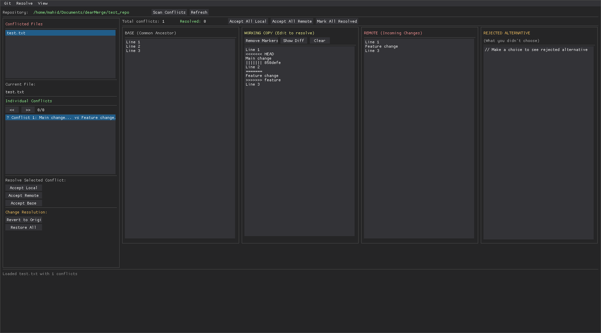

# dearMerge

A Meld-inspired git-merge tool written using Python and dearPyGui

## Licensing

As this was initially generated with AI, *the source code*, as far as I'm 
aware currently (June 2025) is, in the US, automatically public domain. Thus, `main.py` in the [initial
commit](https://raw.githubusercontent.com/StandingPadAnimations/dearMerge/ab484bcb4a5a0fb92a6ae491452252aa82f45b57/main.py) 
of this repo is completely public domain, and is marked with the [Unlicense](https://unlicense.org/)

However, any code I've written since that initial generation is licensed under
the GPL. Thus, for all other commits, this project will be under the GPL.
